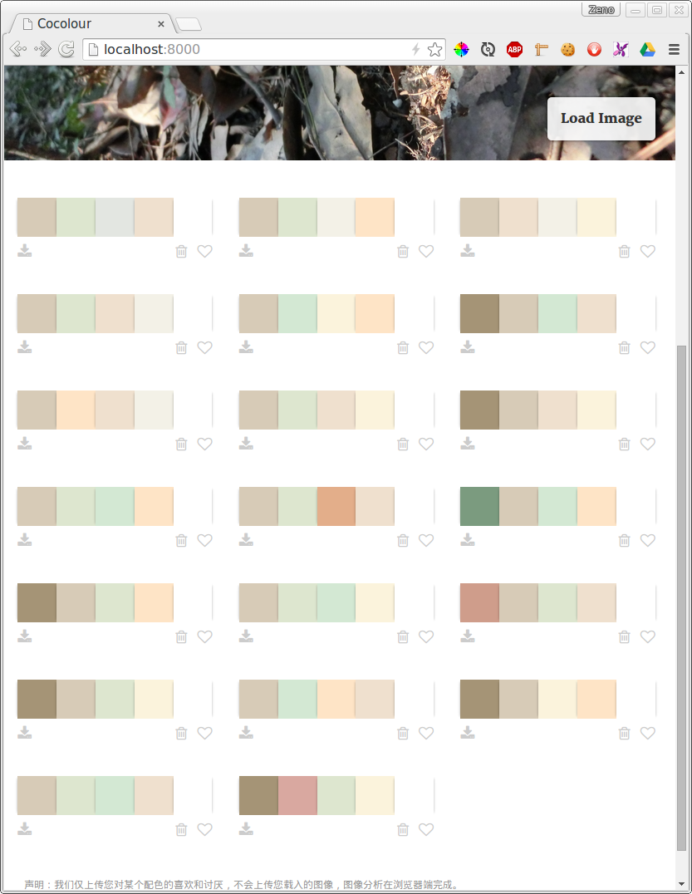
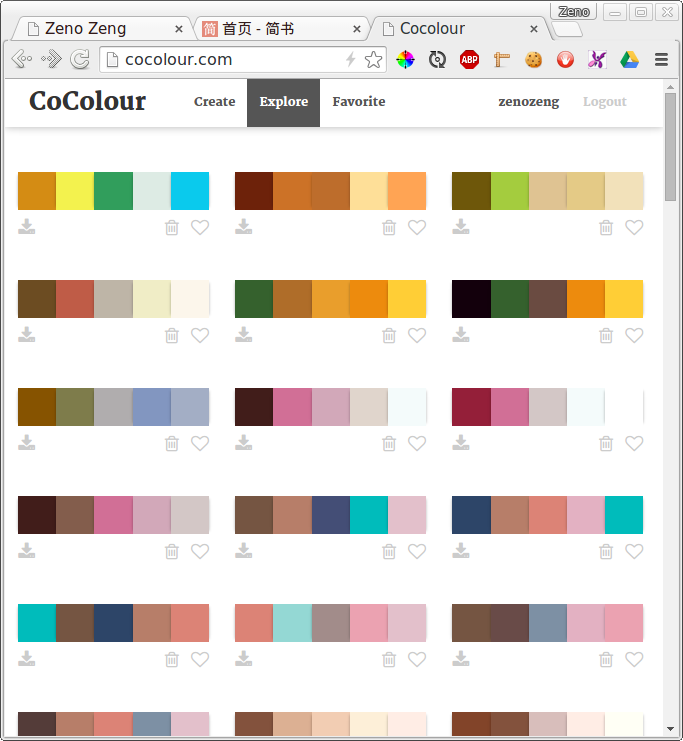
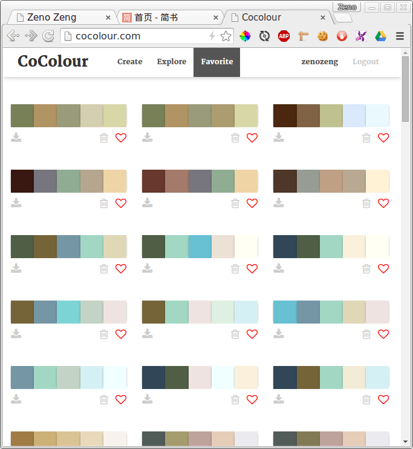
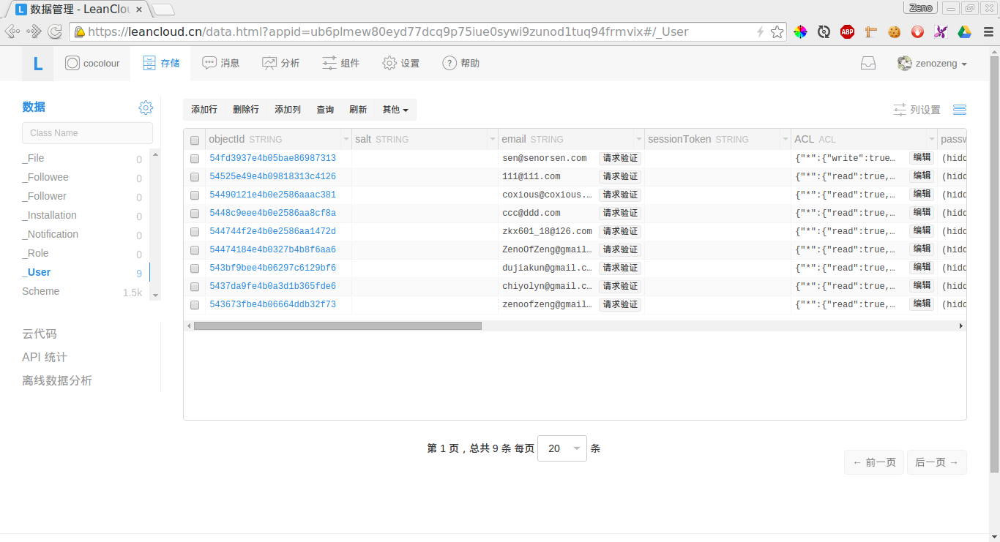

# Cocolour Report

## 项目成果

### 实验数据

We use `LeanCould` as our database service.
And the data can be downloaded from our Github Repository.

https://github.com/zenozeng/cocolour/tree/master/data

本项目目前共产生有效数据 1398 条：
其中正向偏好数据 845 条，负向偏好数据 553 条。
共 6 个账号产生数据。

### Cocolour.com

- 基于图片的智能配色推荐

    

- 查看大家的配色

    

- 个人的 Favorite

    

- 用户系统

    

### 算法简述

我们的算法整体上输入参数为一张图片，而输出则是许多组配色方案。
算法由两部分组成，第一部分是基于 K-Means 将图片分解为几个主要的颜色，
而第二部分则是根据我们的实验结果，利用神经网络算法进行训练得到一个估价函数，
然后结合遗传算法进行对较优解的快速搜索。

以下将逐块具体描述各个部分的算法。

### Colors Extracting Algorithm based on K-Means，CIE76 and CSS Color Module Level 3

实验过程中我们发现基于 RGB 色彩空间的 K-Means 算法可以快速得到图像中的主要颜色。
然而 RGB 的色彩距离与对人类感知来说是不均匀的。
因此换用 CIE2000 这个色彩距离算法，然而由于我们的运行环境是浏览器，性能相对还是比较敏感的，
最后我们换用效果稍逊但是性能更好的 CIE76 算法（较之 CIE2000 少了一些校正因子，就是朴素的 Lab 距离）。

K-Means 的算法特点决定了其结果会非常严重的受到初始值的影响。比如如果取了一个距离多个色比较近的色，这些色彩都会聚合到那个cluster里头去，就会导致严重的色彩损失。为了应对这个现象，增加了初始中心点的数量，然后采用CSS Color Module Level 3 (W3C Recommendation 07 June 2011) 里的颜色关键字来作为种子。这样可以覆盖大多数常见的颜色。事实上效果也相当不错。

#### 算法描述

算法的输入量为图片。输出量为图片的几个主要颜色。
算法的步骤：

1. 将图片丢到 canvas 里
2. 将图片 scale 到一个较小的尺寸
3. 获取每个像素的 RGB 值
4. 将 RGB 数组 map 到 Lab 色彩空间下的数组
5. 载入色彩中心种子（Colors defined in CSS Color Module Level 3），每个独立为一个堆
6. 对每个颜色，计算其到各个色彩中心的 Lab 空间距离
    ```coffeescript
    CIE76 = (lab1, lab2) ->
      sum = 0
      lab1.forEach (val, i) ->
        sum += Math.pow((val - lab2[i]), 2)
      Math.sqrt sum
    ```
7. 对每个颜色，将其置入离其最近的色彩中心所在的堆
8. 移除空堆
9. 对每个堆，重新计算色彩中心（离Lab算术平均值距离最近的点）
10. 重复 6-9，值得色彩中心不再发生变化或者超时

Visualization Demo (but in RGB & K-Means): http://zenozeng.github.io/colors-clustering-visualization/

### 神经网络训练模型

在我们的数据集中我们采用了这样的神经网络结构：
首先是一个 16\*1\*1 的输入层，
然后是一个 16 节点的全连接网络层，
最后是一个 2 节点 softmax 的输出层。

#### 输入数据

一个配色是由五个 Color 组成的数组。
每个 Color 是一个 RGB 的数组：[R, G, B],
R ∈ [0, 255], G ∈ [0, 255], B ∈ [0, 255]。

#### 数据预处理

对每个 Color，其 RGB 值会被转换为 HSL，并对其进行标准化。
H ∈ [0, 1], S ∈ [0, 1], L ∈ [0, 1]。
每个 HSL 值是一个 toFixed(3) 的 float。

这样操作以后得到一个这样结构的数组：

```
[
    [H, S, L],
    [H, S, L],
    [H, S, L],
    [H, S, L],
    [H, S, L]
]
```

计算两两色彩之间的 HSL 距离，记录最小值。

然后对其进行 flatten 操作，得到一个一维的数组：
`[H1, S1, L1, H2, S2, L2, H3, S3, L3, H4, S4, L4, H5, S5, L5]`

将最小色彩距离 push 到该一维数组内得到一个包含 16 元素的一维数组。

#### 训练数据的产生

训练数据是由人工标记产生的：
在本项目的中期之前，我们构建了一个简单系统可以基于图片的颜色随机生成配色。
用户可在这个系统上，置入图片，然后选择喜欢的配色和不喜欢的配色去标记。
产生的数据由项目成员 Chiyo Lyn 进行人工筛选，筛去不合理的配色偏好（通常是一些失误标记）。

本项目的数据来源（感谢热心的贡献者！）（字母序）：

- Chiyo Lyn (Project Member)

- Coxious (Web Developer, QSC Tech)

- Du Jiakun (Web Developer, Taobao UED)

- Senorsen (Web Developer, QSC Tech)

- Zeno Zeng (Project Member)

- Zhao Kaixiang (Web Developer, QSC Tech)

#### 算法

1. 构造神经网络

```
layers = [
    # input: 5 colors * 1 * [H, S, L]
    {type: 'input', out_sx: 16, out_sy: 1, out_depth: 1},

    # fully connected layers
    {type: 'fc', num_neurons: 16, activation: 'sigmoid'},

    # {type:'regression', num_neurons: 8},

    # In softmax, the outputs are probabilities that sum to 1
    {type: 'softmax', num_classes: 2}
    ```

2. 数据预处理

3. 输入训练样本数据

    对每个训练数据，以 0.05 的学习速率，每五个样例执行一次权重更新。

4. 输入验证数据，并验证结果

#### 结果验证

神经网络是一个 CPU 运算比较密集的操作，而且由于其存在随机性，为了正确判断每次参数调整的结果，
我们在试验中通过利用多核（用 Node.JS 写了一个简单的 master-slave 模型）来进行多次运算而观察其统计结果的稳定性。

#### 应用训练结果

我们将训练后产生的神经网络结果导出为 JSON，然后由前端网页 load 进来，
这样就可以使用神经网络结果作为一个配色方案的估价函数了。

### 遗传算法的应用

在颜色比较多的情况下，如果进行穷举计算，将会耗费大量的时间。
在我们的实际工程中这是不现实的。我们采用了遗传算法来进行快速的搜索较优解。
我们做的假设是：一个较优配色中的颜色应当是较优的。
基于这个原则，我们构造了一个[遗传算法的库](https://github.com/zenozeng/gene-pool)（基于分片计算，有超时机制）。
然后定义环境 K 值为 20，突变率为 0.2，出生率为 1，
最大计算时限为 800ms，
以色彩权重作为基因的权重（随机出现概率），
以上述神经网络训练出来的评判函数作为该遗传算法的 fitness 函数。

#### 算法描述

1. 输入产生的颜色作为基因库，一个颜色作为一个基因
2. 从基因库里随机选取基因作为初代，每个个体含有 5 个互不重叠的基因，初代共有 20 个个体
3. 生成一个零到一之间的随机数
4. 若该随机数小于突变率（0.2），从基因库中随机选择一个基因
5. 若该随机数大于等于突变率，从当前种群中存在的基因里随机获取一个基因
   ```javascript
   // 从当前种群中随机获取基因
   population.getRandomGene = function() {
       var random = Math.random();
       // 随机选择，越靠前（fitness较高）的基因有较大概率得到遗传
       var individual = this.population[(random * random * this.population.length) | 0];
       return individual[(this.N * random) | 0];
   };
   ```
6. 重复 3-5 过程，直到产生了 20 个新个体，每个个体都应有 5 个互不重叠的基因
7. 对每个存在的个体计算其 fitness（该评判函数来自上文神经网络训练结果）
8. 对所有个体按照 fitness 排序（由高到低）
9. 仅保留 fitness 前二十的个体，舍弃其余个体
10. 重复 3-9 的过程，直到耗费的总时间达到预设值

### Repositories Created (hosted on Github)

- [act.js](https://github.com/zenozeng/act.js)

    Simple (in-browser) JavaScript to generate Adobe Color Table (.act)[^[Adobe Photoshop File Formats Specification](http://www.adobe.com/devnet-apps/photoshop/fileformatashtml/)] files using Uint8Array, Blob API and FileReader API.

    See also:

    - [Big endian and Little endian](http://www.cnblogs.com/luxiaoxun/archive/2012/09/05/2671697.html)

    - [actpalette](https://github.com/bdon/actpalette)

    - [Blob API](https://developer.mozilla.org/en-US/docs/Web/API/Blob)

    - [Is there a “default” MIME type?](http://stackoverflow.com/questions/12539058/is-there-a-default-mime-type)

    - [How to load color table in a indexed mode file??](https://forums.adobe.com/message/2205681#2205681)

    - [Color swatch file formats](http://www.selapa.net/swatches/colors/fileformats.php)

- [gene-pool](https://github.com/zenozeng/gene-pool)

    Genetic algorithms in a given gene pool.

    Also, a visualization demo was created: http://zenozeng.github.io/gene-pool/demo/

- [colors-clustering](https://github.com/zenozeng/colors-clustering)

    Colors clustering based on K-means algorithm & CIE76.
    The seeds are extended color keywords from CSS Color Module Level 3 (W3C Recommendation 07 June 2011).

    Visualization Demo (but in RGB & K-Means): http://zenozeng.github.io/colors-clustering-visualization/
